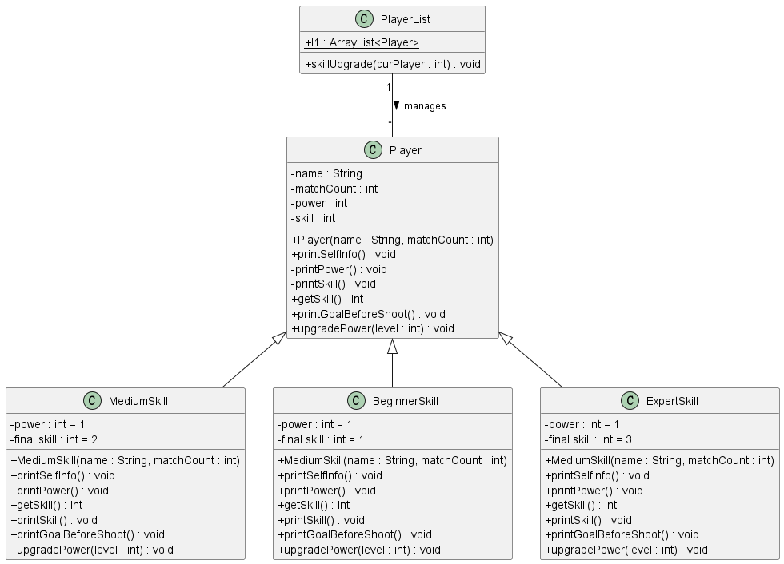
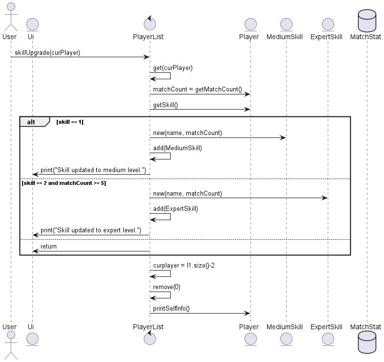

# Developer Guide

## Acknowledgements

{list here sources of all reused/adapted ideas, code, documentation, and third-party libraries -- include links to the original source as well}

## Class Structure

### Player Class

- **Attributes:**
    - `name`: String - The player's name.
    - `matchCount`: int - The number of matches played.
    - `power`: int - The player's power level.
    - `skill`: int - The player's skill level.

- **Methods:**
    - `printSelfInfo()`: void - Displays the player's basic information.
    - `printGoalBeforeShoot()`: void - Abstract method to display goal during a penalty shoot.
    - `getSkill()`: int - Returns the player's skill level.
       
### Skill Level Subclasses (BeginnerSkill, MediumSkill, ExpertSkill)

These subclasses extend Player, each representing different skill levels and overriding methods to provide specific functionalities.

### PlayerList Class

- **Attributes:**
    - `l1`: ArrayList<Player> - A list of player objects.

- **Methods:**
    - `skillUpgrade(int curPlayer)`: void - Upgrades the skill level of the player at the specified index.


## Design & implementation

The implementation of the player management system in the NUSFC24 is designed with extensibility and flexibility in mind. This section delves into the design rationale, how the system accommodates new and returning players, and how skill upgrades are managed.

### Player Management

The system is built around the Player class and its subclasses (BeginnerSkill, MediumSkill, ExpertSkill), with a `PlayerList` class managing all player instances. This design allows for a scalable way to add new player types and manage their interactions within the game:

- **Player Class**: Serves as the base class for all players, encapsulating common attributes such as `name`, `matchCount`, `power`, and `skill`, and common behaviors.
- **Skill Level Subclasses**: These subclasses inherit from Player and override specific methods to reflect their skill level's unique behaviors and characteristics.
- **PlayerList Class**: Manages a collection of Player instances, facilitating operations like adding new players and upgrading their skills through the `skillUpgrade` method.

### Handling New and Returning Players

Upon a user entering the game, the system determines whether to fetch an existing player from PlayerList or to create a new player instance. This process is crucial for providing a seamless user experience, whether they are returning players or first-time participants.

- **New Players**: For users new to the game, a Player object is created with the BeginnerSkill level by default. This player is then added to the PlayerList, ready for game participation.
- **Returning Players**: For users returning to the game, their Player object is retrieved from the PlayerList using identifying information (e.g., player name). This allows the game to maintain continuity in the player's progression.

### Skill Upgrade Mechanism

The `skillUpgrade` method in the `PlayerList` class is a key feature, allowing players to improve their skills based on game performance. The method checks the player's current skill and match count, upgrading their skill level if certain conditions are met.
he mechanism operates through a structured process, enhancing the gaming experience by offering a realistic approach to skill progression:

1. **Skill Level Assessment**: The system evaluates a player's current skill level alongside their performance metrics, such as match count and success rate.

2. **Determination of Skill Upgrade Eligibility**: Utilizing predefined criteria, the system determines if a player qualifies for a skill upgrade. These criteria may include metrics like a minimum number of matches played or specific performance thresholds.

3. **Application of Skill Upgrade**: Eligible players will have their skill attribute adjusted to a higher level. This upgrade might unlock new abilities, enhance stats, or offer other in-game advantages.

4. **Feedback to the User**: The system informs the user of the successful skill upgrade through UI messages or other feedback mechanisms, providing immediate recognition of their achievement.


## Product scope
### Target user profile

{Describe the target user profile}

### Value proposition

{Describe the value proposition: what problem does it solve?}

## User Stories

|Version| As a ... | I want to ... | So that I can ...|
|--------|----------|---------------|------------------|
|v1.0|new user|see usage instructions|refer to them when I forget how to use the application|
|v2.0|user|find a to-do item by name|locate a to-do without having to go through the entire list|

## Non-Functional Requirements

{Give non-functional requirements}

## Glossary

* *glossary item* - Definition

## Instructions for manual testing

{Give instructions on how to do a manual product testing e.g., how to load sample data to be used for testing}


## Implementation
This section describes some noteworthy details on how certain features are implemented.


### Real penalty shootout setting


As we are making a penalty shootout game, we should make the procedure of a match in the game the same as that of a 
real penalty shootout. Here is the procedure of a real penalty shootout:


Teams take turns to kick from the penalty mark, until each has taken five kicks. However, if one side has scored more 
goals than the other could possibly reach with all of its remaining kicks, the shoot-out immediately ends, regardless 
of the number of kicks remaining; this basis is called "best-of-five kicks".


If after five rounds of kicks, the teams have scored an equal number of goals (or neither team has scored any goals), 
additional rounds of one kick each are used until one team scores and the other misses. This is known as sudden death.


The procedure is facilitated by `MatchStat`. It records current round and match numbers. 
The `updateStat(boolean isPlayer, boolean isGoal)` method converts the outcomes of player's commands into player score 
and Ai score after `penalty` or `save` commands. The `decideMatchEnd()` method decides whether a match ends based on the 
rules mentioned above. 

As we now only need to record the match stats of one player, the class is implemented as a utility class. (i.e. Using 
class level fields and methods.) We may change it to an instantiable class later when we need to record the match stats 
of multiple players. Here is the class diagram of the class:


## AI Class 

### Overview

The `Ai` class is responsible for generating a random direction for the computer player (AI) to shoot or save in the game. The difficulty level of the game determines the range of directions the AI can choose from.

### Design

The `Ai` class has the following components:

1. `minDirection` and `maxDirection` static variables to store the minimum and maximum direction values based on the difficulty level.
2. A constructor that takes a `DifficultyLevel` object as input and initializes the `minDirection` and `maxDirection` based on the difficulty level.
3. A `getAiDirection()` static method that generates a random direction within the range of `minDirection` and `maxDirection`.
4. Getter methods `getMinDirection()` and `getMaxDirection()` to retrieve the minimum and maximum direction values, respectively.

### Implementation

The `Ai` class is implemented as follows:

```java
public class Ai {
    private static int minDirection;
    private static int maxDirection;

    public Ai(DifficultyLevel difficultyLevel) {
        switch (difficultyLevel) {
            case EASY:
                minDirection = 0;
                maxDirection = 2;
                break;
            case MEDIUM:
                minDirection = 0;
                maxDirection = 3;
                break;
            case HARD:
                minDirection = 0;
                maxDirection = 4;
                break;
        }
    }

    public static int getAiDirection() {
        Random rand = new Random();
        int direction = rand.nextInt(maxDirection - minDirection + 1) + minDirection;
        assert direction >= minDirection && direction <= maxDirection : "Illegal AI direction generated!";
        return direction;
    }

    public static int getMinDirection() {
        return minDirection;
    }

    public static int getMaxDirection() {
        return maxDirection;
    }
}
```

The constructor initializes the `minDirection` and `maxDirection` based on the `DifficultyLevel` parameter. The `getAiDirection()` method generates a random integer within the range of `minDirection` and `maxDirection` using the `Random` class from Java's `util` package.

### Alternatives Considered

An alternative design could be to have separate classes for different difficulty levels, each with its own implementation of the `getAiDirection()` method. However, this would lead to code duplication and make the codebase more difficult to maintain.

## Penalty Class

### Overview

The `Penalty` class handles the penalty command in the game. It prompts the user to enter the direction to shoot the penalty and checks if the user's input is valid. It then compares the user's input with the AI's direction and determines whether a goal is scored or not.

### Design

The `Penalty` class has the following components:

1. A `PENALTY_PROMPT` constant string to display the prompt for the user to enter the penalty direction.
2. An `executePenalty()` method that takes an `Ai` object as input and executes the penalty command.
3. A `getUserPenaltyDirection()` method that prompts the user to enter the penalty direction and returns the corresponding integer value.
4. A `convertToShootDirection()` method that converts the user's input direction to an integer value, validating the input and handling invalid inputs.

### Implementation

The `Penalty` class is implemented as follows:

```java
public class Penalty {
    private static final String PENALTY_PROMPT = "Enter the direction to shoot the penalty (0, 1, or 2): ";

    public static void executePenalty(Ai ai) {
        int userDirection = getUserPenaltyDirection();
        int aiDirection = ai.getAiDirection();
        boolean isGoal = CommandList.goalCheck(userDirection, aiDirection);
        Formatter.printGoalAfterShot(isGoal);
    }

    private static int getUserPenaltyDirection() {
        System.out.print(PENALTY_PROMPT);
        String directionString = Ui.userInput;
        int userDirection = convertToShootDirection(directionString);
        return userDirection;
    }

    public static int convertToShootDirection(String direction) {
        int directionIndex;
        try {
            directionIndex = Integer.parseInt(direction);
        } catch (NumberFormatException e) {
            Formatter.printErrorWrongArgumentType("PENALTY", "^[0-2]$", 0);
            return -1; // Invalid input
        }

        if (directionIndex >= Ai.getMinDirection() && directionIndex <= Ai.getMaxDirection()) {
            return directionIndex;
        } else {
            Formatter.printErrorWrongArgumentType("PENALTY", "^[0-2]$", 0);
            return -1; // Invalid direction
        }
    }
}
```

The `executePenalty()` method calls the `getUserPenaltyDirection()` method to get the user's input direction, gets the AI's direction using the `Ai` class, and then checks if a goal is scored using the `goalCheck()` method in the `CommandList` class. The `getUserPenaltyDirection()` method prompts the user to enter the direction and calls the `convertToShootDirection()` method to validate and convert the user's input.

The `convertToShootDirection()` method first tries to parse the input string into an integer using `Integer.parseInt()`. If the parsing fails, it prints an error message using the `Formatter` class and returns -1 to indicate an invalid input. If the parsing succeeds, it checks if the direction is within the valid range based on the `minDirection` and `maxDirection` values from the `Ai` class. If the direction is valid, it returns the direction index; otherwise, it prints an error message and returns -1.

### Alternatives Considered

An alternative implementation could be to have separate methods for handling different types of input validation, such as checking if the input is a valid integer and checking if the input is within the valid range. This would make the code more modular and easier to maintain.

## DifficultyLevel Enum

### Overview

The `DifficultyLevel` enum represents the difficulty levels of the game. It has three values: `EASY`, `MEDIUM`, and `HARD`.

### Design

The `DifficultyLevel` enum is a simple enumeration that defines the three difficulty levels of the game.

### Implementation

The `DifficultyLevel` enum is implemented as follows:

```java
public enum DifficultyLevel {
    EASY,
    MEDIUM,
    HARD
}
```

### Alternatives Considered

An alternative to using an enum could be to use integer constants or string constants to represent the difficulty levels. However, enums provide type safety and better code readability, making them a preferred choice for representing a fixed set of values.

## Class Diagrams

```
+-------------+
|DifficultyLevel|
+-------------+
| EASY        |
| MEDIUM      |
| HARD        |
+-------------+

+------------+
|     Ai     |
+------------+
| -minDirection: int
| -maxDirection: int
+------------+
| +Ai(difficultyLevel: DifficultyLevel)
| +getAiDirection(): int
| +getMinDirection(): int
| +getMaxDirection(): int
+------------+

+----------------+
|     Penalty    |
+----------------+
| -PENALTY_PROMPT: String
+----------------+
| +executePenalty(ai: Ai): void
| -getUserPenaltyDirection(): int
| +convertToShootDirection(direction: String): int
+----------------+

+----------------+
|   CommandList  |
+----------------+
| +goalCheck(userInput: int, aiInput: int): boolean
+----------------+

+-------------+
|  Formatter  |
+-------------+
| +printGoalAfterShot(goalScored: boolean): void
| +printErrorWrongArgumentType(commandName: String, regex: String, argumentPosition: int): void
+-------------+

+--------+
|   Ui   |
+--------+
| -userInput: String
+--------+

```

The `Ai` class depends on the `DifficultyLevel` enum to determine the range of directions for the AI. The `Penalty` class uses the `Ai` class to get the AI's direction and compares it with the user's input direction. The `CommandList` class provides the `goalCheck()` method to determine if a goal is scored based on the user's and AI's directions. The `Formatter` class is responsible for printing the goal result and error messages related to wrong argument types. The `Ui` class provides the user's input direction to the `Penalty` class.

## Future Enhancements

1. **Adaptive AI Difficulty**: Implement an adaptive AI difficulty system where the AI's behavior changes based on the player's performance. This could involve adjusting the range of directions or introducing other challenges for the AI.

2. **Penalty Shootout Mode**: Implement a penalty shootout mode where the game is decided by a series of penalty kicks. This could involve additional rules and scoring mechanisms specific to penalty shootouts.

3. **Custom Difficulty Levels**: Allow users to define custom difficulty levels by specifying the range of directions or other parameters that affect the AI's behavior.

4. **Advanced AI Strategies**: Enhance the AI's decision-making capabilities by implementing more advanced strategies and algorithms. This could involve considering factors such as the player's previous shots, game statistics, or other relevant data.

5. **Multiplayer Mode**: Implement a multiplayer mode where multiple players can participate in the game, either locally or over a network.

