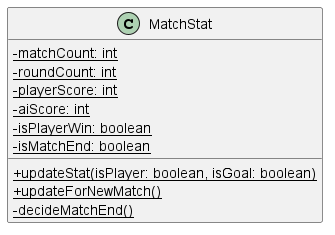

# Developer Guide

## Acknowledgements

{list here sources of all reused/adapted ideas, code, documentation, and third-party libraries -- include links to the original source as well}

## Design & implementation

{Describe the design and implementation of the product. Use UML diagrams and short code snippets where applicable.}

## Product scope
### Target user profile

{Describe the target user profile}

### Value proposition

{Describe the value proposition: what problem does it solve?}

## User Stories

|Version| As a ... | I want to ... | So that I can ...|
|--------|----------|---------------|------------------|
|v1.0|new user|see usage instructions|refer to them when I forget how to use the application|
|v2.0|user|find a to-do item by name|locate a to-do without having to go through the entire list|

## Non-Functional Requirements

{Give non-functional requirements}

## Glossary

* *glossary item* - Definition

## Instructions for manual testing

{Give instructions on how to do a manual product testing e.g., how to load sample data to be used for testing}

## Implementation
This section describes some noteworthy details on how certain features are implemented.

### Real penalty shootout setting

As we are making a penalty shootout game, we should make the procedure of a match in the game the same as that of a 
real penalty shootout. Here is the procedure of a real penalty shootout:

Teams take turns to kick from the penalty mark, until each has taken five kicks. However, if one side has scored more 
goals than the other could possibly reach with all of its remaining kicks, the shoot-out immediately ends, regardless 
of the number of kicks remaining; this basis is called "best-of-five kicks".

If after five rounds of kicks, the teams have scored an equal number of goals (or neither team has scored any goals), 
additional rounds of one kick each are used until one team scores and the other misses. This is known as sudden death.

The procedure is facilitated by `MatchStat`. It records current round and match numbers. 
The `updateStat(boolean isPlayer, boolean isGoal)` method converts the outcomes of player's commands into player score 
and Ai score after `penalty` or `save` commands. The `decideMatchEnd()` method decides whether a match ends based on the 
rules mentioned above. 

As we now only need to record the match stats of one player, the class is implemented as a utility class. (i.e. Using 
class level fields and methods.) We may change it to an instantiable class later when we need to record the match stats 
of multiple players. Here is the class diagram of the class:

